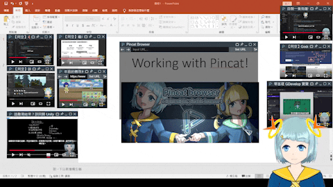

# Pincat Browser
**Pincat browser** is a lightweight, pinable browser base on Chromium for Windows, Linux and macOS.

Pincat only built to provide only the necessary features, with **JavaScript/CSS** scripts injection you can remove unnecessary information or perform some data annotation on the website, and pin it to your screen.

✨Pincat also also supports **local file browsing**. (By dragging the file into the URL bar)

# Instructions
## 1. Setup
Download the scripts or prebuilt files from github repo.

## 2. Scripts Injection
1. Writing JavaScript for modifying web content.
    - ✨You can get **default addons**  [in the *Addons directory*](./Addons/) .
 
2. Add the JavaScript files to **Addon Folder**.
   

3. After website loadded, click the addon button to execute the script.

## 3. Pin to the Screen
You can **pin and unpin** the browser using the pushpin icon in the window menu.

# Demo
- #### Using Addons.
    

- #### Working with Pincat (●ˇ∀ˇ●).
    
